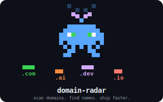

# mcp-domain-radar

<p align="center">
  
</p>

<p align="center">
  <a href="https://www.npmjs.com/package/mcp-domain-radar"></a>
  <a href="https://www.npmjs.com/package/mcp-domain-radar"></a>
  <a href="https://github.com/sonwr/mcp-domain-radar/blob/main/LICENSE"></a>
</p>

> **MCP server that checks domain availability in real-time during brand naming.**
>
> Name your brand. Check the domain. All in one conversation.

---

## Why?

We've all been there:

```
You:    "Suggest a name for my service"
AI:     "How about NexFlow?"
You:     Search nexflow.com... already taken
You:    "Another one"
AI:     "DataPulse?"
You:     Search datapulse.com... also taken
You:    "..."
        (repeat 10 times)
```

Install **mcp-domain-radar** once, and your AI checks domain availability the moment it thinks of a name. No more switching between browser and terminal.

---

## Quick Start

**1. Install**

```bash
npm install -g mcp-domain-radar
```

**2. Connect to Claude Code**

```bash
claude mcp add domain-radar -- mcp-domain-radar
```

**3. Install the brand-naming skill** (optional but recommended)

```bash
mkdir -p ~/.claude/skills/brand-naming
cp node_modules/mcp-domain-radar/.claude/skills/brand-naming/SKILL.md ~/.claude/skills/brand-naming/
```

Or copy it manually from the [GitHub repo](.claude/skills/brand-naming/SKILL.md).

**4. Use it**

With the skill installed, type `/brand-naming` in Claude Code to start a guided naming session.

Or just talk naturally:

```
"I'm building a task management app for developers.
 Help me find a brand name with an available domain."
```

Claude will automatically check domains as it brainstorms.

---

## What You Get

### 4 Tools — automatically used by Claude during conversations

| Tool | What it does |
|------|-------------|
| **`check_domains`** | Check exact domain names — `"Is mybrand.com taken?"` |
| **`check_brand_domains`** | Check one name across 17+ TLDs at once — `"Check nexflow across all popular TLDs"` |
| **`suggest_and_check_domains`** | Generate name variations from keywords & check all — `"Brainstorm names from keywords: pulse, data, flow"` |
| **`list_supported_tlds`** | Show all TLDs this server supports |

### 30+ TLDs — including trending ones

| Category | TLDs |
|----------|------|
| **Classic** | `.com` `.net` `.org` |
| **Tech / Startup** | `.io` `.dev` `.app` `.co` `.tech` `.sh` |
| **Trending** | **`.ai`** **`.gg`** **`.so`** `.me` `.xyz` `.cc` `.to` `.run` `.cloud` `.tv` |
| **Creative** | `.lol` `.wtf` `.cool` `.world` `.studio` `.design` |
| **Commerce** | `.online` `.site` `.store` |
| **Country** | `.kr` |

---

## Examples

### Check a specific name
```
You: Check if "nexflow" is available — try .com, .io, .ai, and .dev
```
```
AVAILABLE:
  + nexflow.dev
  + nexflow.ai

TAKEN:
  - nexflow.com
  - nexflow.io

--- 2 available / 2 taken / 0 unknown ---
```

### Brainstorm from keywords
```
You: I need a name for an AI code review tool.
     Keywords: code, review, pulse, scan.
     Find me names with available domains.
```
```
Generated 20 name variations from: code, review, pulse, scan
Checking .com .io .ai .dev .app .co for each

+ codepulse (compound) — available: .dev, .ai | taken: .com, .io
+ scanflow (suffix) — available: .ai, .dev, .app | taken: .com
+ getpulse (prefix) — available: .dev, .co | taken: .com, .io, .ai
+ revscan (blend) — available: .com, .io, .ai, .dev, .app, .co
- codelab (suffix) — all checked TLDs taken

TOP PICKS (have available domains):
  revscan → revscan.com, revscan.io, revscan.ai, revscan.dev, revscan.app, revscan.co
  codepulse → codepulse.dev, codepulse.ai
  scanflow → scanflow.ai, scanflow.dev, scanflow.app
```

### Guided workflow with the `brand-naming` prompt
The server includes a built-in prompt template that walks you through the full naming process step by step.

---

## How It Works

```
Your question
    │
    ▼
  Claude brainstorms names
    │
    ▼
  mcp-domain-radar
    ├── 1. DNS lookup (fast — if it resolves, it's taken)
    └── 2. WHOIS query (definitive — checks registration status)
    │
    ▼
  Only names with available domains are recommended
```

- **No API keys required** — uses native DNS and WHOIS protocols
- **Rate-limit friendly** — batches queries with delays
- **Works offline for DNS checks** — WHOIS requires network

---

## Manual Setup (alternative)

If you prefer to configure manually, add to `~/.claude/settings.json`:

```json
{
  "mcpServers": {
    "domain-radar": {
      "command": "mcp-domain-radar"
    }
  }
}
```

Or run from source:

```json
{
  "mcpServers": {
    "domain-radar": {
      "command": "node",
      "args": ["/path/to/mcp-domain-radar/dist/index.js"]
    }
  }
}
```

---

## Development

```bash
git clone https://github.com/sonwr/mcp-domain-radar.git
cd mcp-domain-radar
npm install
npm run build
```

Test locally:

```bash
claude mcp add domain-radar -- node ./dist/index.js
```

---

## Roadmap

- [ ] Domain price estimation per registrar
- [ ] Expiring / recently dropped domain suggestions
- [ ] Registrar API integration (Namecheap, Cloudflare, GoDaddy)
- [ ] Internationalized domain name (IDN) support
- [ ] More TLDs and WHOIS servers

Contributions welcome! Open an issue or PR.

---

## License

MIT
